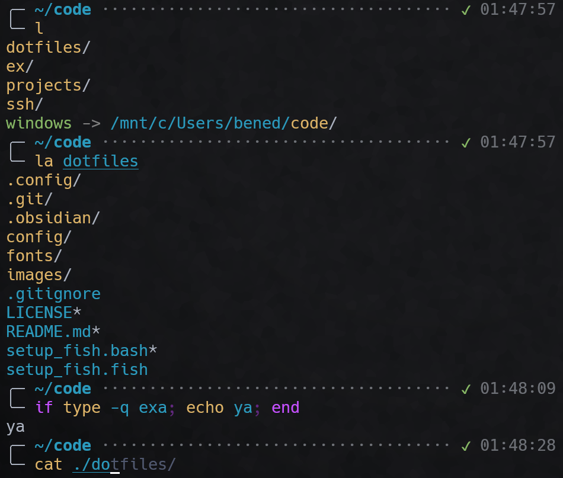

# dotfiles

A collection of commonly used utilities. Includes, for example, shell scripts
and styles.

## Fish shell

Fish shell is like bash but better in every way. In addition to all sorts of
customisation opportunities, the shell offers native completion hints, syntax
highlighting of commands, and epic prompt customisation.

	

> Warning: the following will yeet your existing `~/.config/fish` into oblivion.
>          I'll fix that at some point...

Run `source setup.bash` to set it up. This will:
* Install fish-shell
* Set fish-shell as default shell
* Alias relevant parts of `.config/fish`
* Install/build useful packages
  * fortune + cowsay for greeting
  * highlight for highlighting stuff
  * exa for ls improvement

## Fonts and images

This repo contains the `fonts/` and `images/` I use for programming
environments. Notably, Hack is the font I use for code and terminal.

> ["Inter"](https://fonts.google.com/specimen/Inter) is another non-monospace
> font which looks nice, should add that at some point!

	
Reference image for Karmilla

	

## Configs and settings

`config/` contains various configurations (not exactly up to date :3) for
software I use, including Windows Terminal, Visual Studio Code, and IntelliJ
IDEA.

## Terminal Prompt

## TODO

* Fish keybinds
* VSCode keybinds
* Adjust Windows Terminal keybinds (to match vscode)
* Update IntelliJ keybinds
* Update README with tooling
* Obsidian keybinds?
* Future potential items:
	* virtualenv
	* compiler versions/gradle stuff
	* task running time
